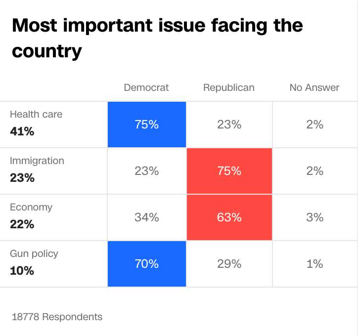
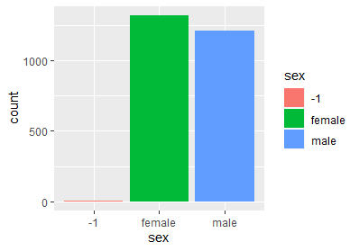
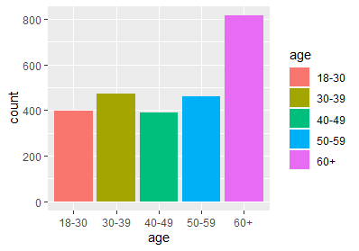

```{r setup, include=FALSE}
knitr::opts_chunk$set(echo = TRUE)
```


### I.	Abstract
### II.	Application of Modeling
### III.	Data Analysis 
### IV.	Report

a.	Intellectual or Political Context

Regardless of party, health insurance coverage remains a crucial campaign issue for candidates to resonate with voters on. CNN conducted a series of polls surrounding voting issues for 2018 voters. A 2018 pre-election poll asked likely voters how important an issue was to their vote and 52% said healthcare over other issues. This trend can be attributed to the failed repeal of the ACA in mid-2017. Following the 2018 general election, CNN conducted an exit poll asking voters the most important issue facing the country: healthcare, immigration, economy, and gun policy with 41% of respondents listing healthcare. 
 


 Looking at 2020, healthcare remains a crucial issue for voters. According to a poll conducted by Morning Consult and the Bipartisan Policy Centers, 56% of respondents selected health care as the most important issue in their vote choice for the presidential election. Within health policy: 66% of Democrats, 54% of Independents, and 46% of Republicans selected it as their most important issue.  Healthcare remains incredibly important to voters in 2020, making it worth studying.  The issue of healthcare has become incredibly contentious issue within party structures and between the two major parties. To better understand the importance of healthcare, it makes sense to look at the history and implementation of the Patient Protection and Affordable Care Act as the majority of current healthcare surrounds next steps for the legislation. 

 The Patient Protection and Affordable Care Act, commonly known as Obamacare. Signed in 2010, the ACA was signed into law to expand Medicaid with emphasis on making health insurance more affordable and supporting innovation to lower individual’s overall cost. 
The major provisions of the ACA were implemented by 2014, covering an additional 20 to 24 million people. The 2010 legislation has been extremely divisive since it was passed. Liberals believe it did not go far enough in providing coverage, while conservatives have rallied against the individual mandate. This divisiveness provided voters in 2016, the first presidential election year since the bill’s full implementation, a unique set of circumstances. We looked towards this election to get a better understanding of how healthcare coverage specifically impacts elections, attempting to bypass rhetoric about the issue and see how those directly impacted responded. We believe this data will give insight to the 2020 primaries where healthcare remains a prominent issue and over twenty candidates are currently vying for the Democratic nomination. By focusing on 2016 primaries, a year with a large number of Republican candidates, we hope to get a better understanding of the issue heading into 2020. As healthcare continues to be a key issue across demographics, this data will prove valuable to candidates on the federal and state level. 


Currently, literature exists on Medicaid’s impact on voter participation in general elections such as the 2008 Oregon election. This helped us better understand the potential for confounding variables in our own study and understand the viability of our own question. 

In an attempt to better understand the interaction between government policy and political participation, researchers conducted a study on the impacts of Medicaid enrollment on voter turnout and registration. In 2008, Oregon used a lottery system to allocate 10,000 available slots in their Medicaid program to a waiting list of 90,000 low-income, previously uninsured adults (aged 19-64). The researchers linked administrative data on lottery participants and Medicaid enrollment with Oregon’s statewide voter lists, allowing them to analyze voter turnout and registration for 2010. The researchers highlight the presence of confounding variables but conclude that the use of a randomized evaluate design avoids contamination by the confounding variables. These confounding variables include socio-economic status and health which could both impact voter participation (384). The study concluded that Medicaid enrollment impacted the 2008 election, but not subsequent elections. It should be noted that the 2008 election had much higher turnout the November 2010 election which can be attributed to 2008 being a Presidential election year. The study also notes that the Oregon expansion was not partisan or politicized while the national conversation was highly divisive. 

### Data Collection Procedure 

Our data source was the American National Election Studies’ (ANES) 2016 Time Series Study.  The study is conducted through a collaboration between University of Michigan and Stanford University. The data includes various demographics and political variables taken from pre- and post-election surveys of the voting-age population in attempt to get a sample representative of the US adult population defined as individuals over the age of 18 with a valid mailing address. The data was collected through both face-to-face and internet responses conducted between September 7th and November 7th, 2016 for the pre-election survey and between November 9th and January 8th, 2017 for the post-election survey. It should be noted that respondents from Alaska and Hawaii were not included in the face-to-face model but were included in the Internet component. Individuals from Alaska and Hawaii make up less than one percent of the study population. It should also be noted that the survey was offered in both English and Spanish. We retrieved the data from the Inter-University Consortium for Political and Social Research. 

### Features of the data 
	
We used the following variables to focus our study on: 

V161277 - PRE: Initial R employment status, start of occupation module
Recoded to “employment status” 

V161267 – PRE: Respondent age 
Recoded as “age”

V161113 – PRE: Favor or oppose 2010 health care law 
recoded as “favor or oppose ACA”

V161112 – PRE: Does R have health insurance
recoded as “insurance”

V161270 – PRE: Highest level of Education
recoded as “education” 

V161307 – PRE: Social class (2-question version)
 recoded as “socio”

V161342 – PRE FTF CASI/WEB: R self-identified gender
recoded as “gender”

V16021 – PRE: Did R vote in a Presidential primary or caucus
Recoded as “voted in presidential primary” 

V161019 – PRE: Party of Registration
	Recoded as “party”

One issue we had to 

### Statistic Methods
Our independent variable x tracked whether or not an individual had healthcare coverage. Our independent variable, y, tracked whether or not an individual had voted in the 2016 presidential primary. Our control variables are gender, race, and education level. Based on the data provided and scope of our question, we presented the following hypothesis: 

H_1: Individuals without healthcare would be more likely to vote in the primary
H_0: Individuals without healthcare would be less likely to vote in the primary

Linear Regressions: 
〖y= a〗_1 x_1+ a_2 x_2+⋯ a_n x_n

y=a_1 (insurance)

〖(dep)= a〗_1 (insurance)+ a_2 (ACA)+ a_n (age)+ a_n (edu)+ a_n (job)+ a_n (party)+ a_n (sex)+ a_n (socio) 


Based on these equations, we ran the following output functions: 

output1 <- lm(primary2016 ~ V161112, data=anes_subset03)
summary(output1)

output4 <- lm(primary2016 ~ insurance + job + age + ACA + edu + socio + sex, data = anes_subset03)

## Results 

One issue with our study and data is significant multicollinearity among our variables. Similar to the literature review, we found 


# footnotes

  Enten, H. (2019, March 26). Unlike Mueller, health care will likely be a top issue in 2020. Retrieved from https://www.cnn.com/2019/03/26/politics/health-care-2020-campaign-issue/index.html.
  
  Baicker, K., & Finkelstein, A. (2019). The Impact of Medicaid Expansion on Voter Participation: Evidence from the Oregon Health Insurance Experiment. Quarterly Journal of Political Science, 14(4), 383–400. Retrieved from https://economics.mit.edu/files/18481

# ................................................
# Display and Findings






# ................................................
# Workflow
## assign issues


## Lauen -- create and upload files


## Olan and Hubbert --- Pull files


## Lauren --- Submit files  ss

# .........................................
# the end